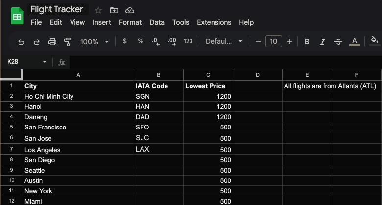
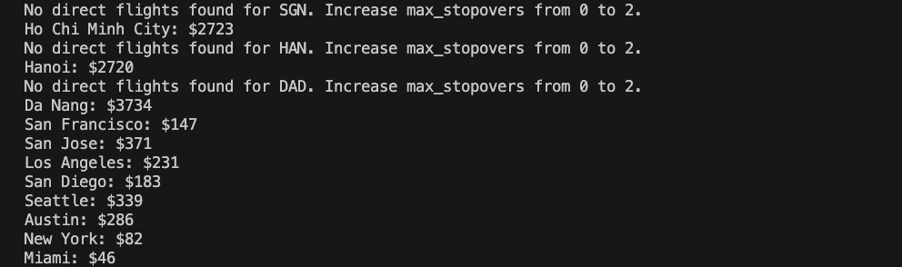
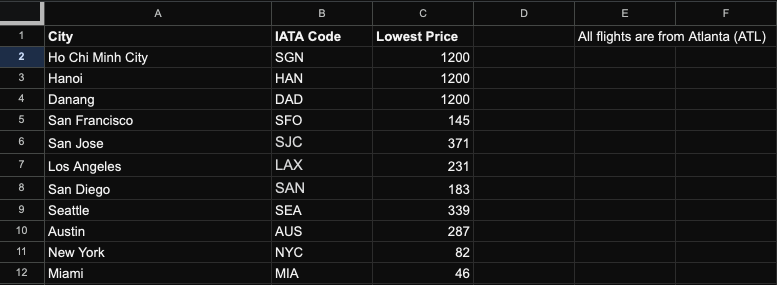
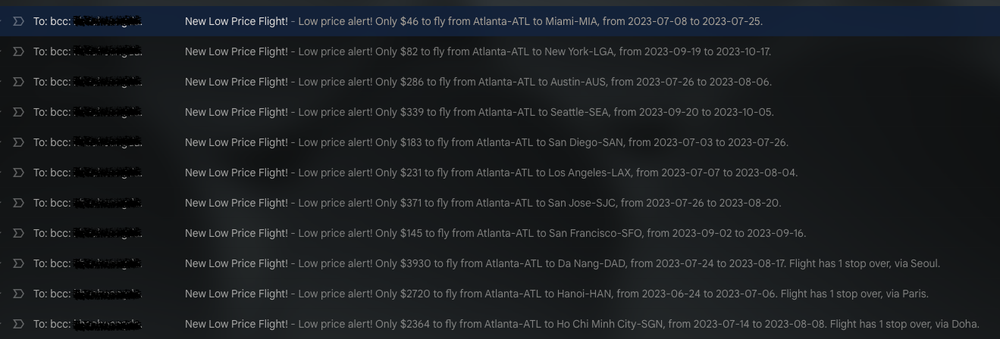
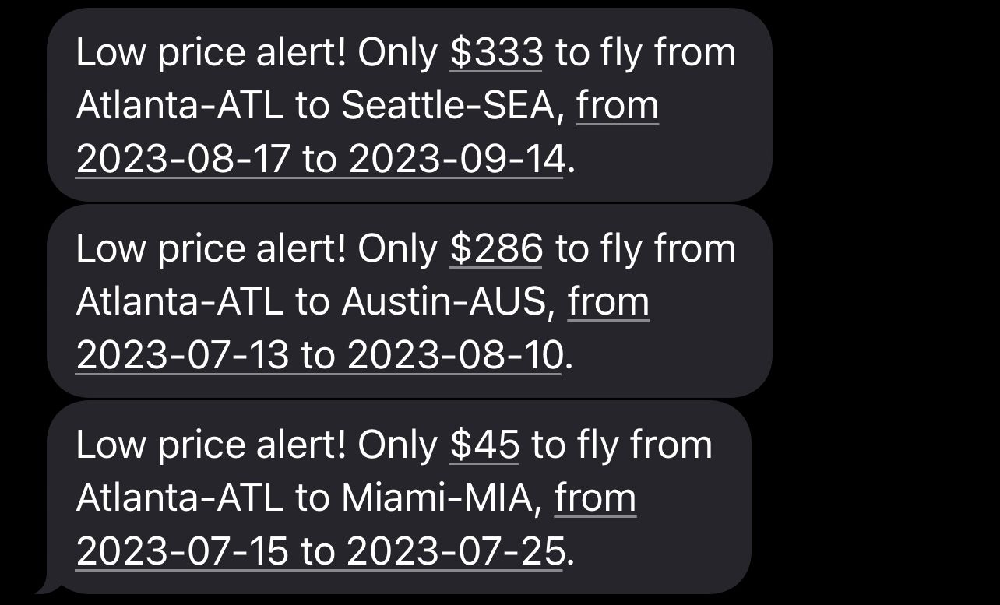

# Flight Tracker
This project tracks the cheapest flights from ATL (or CHA) to SGN, SFO, LAX, NYC, etc. for the next six months, with data being added to a linked Google Sheet. If a city is added without an [IATA code](https://en.wikipedia.org/wiki/IATA_airport_code), the Python script automatically updates it with the correct code. If the script finds a cheaper flight price, it will send an SMS alert using Twilio, as well as an email via SMTP.

To get started, run `cp .env.sample .env` to create an `.env` file and update the file accordingly. Users are required to sign up at [Sheety](https://sheety.co/), [Tequila by Kiwi](https://tequila.kiwi.com/), and [twilio](https://www.twilio.com/) in order to run this Python script.

### Updating Google Sheet

### Console output

### Final result

### Email

### SMS

