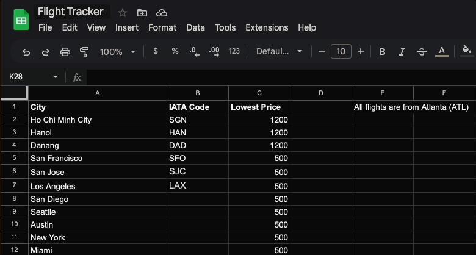
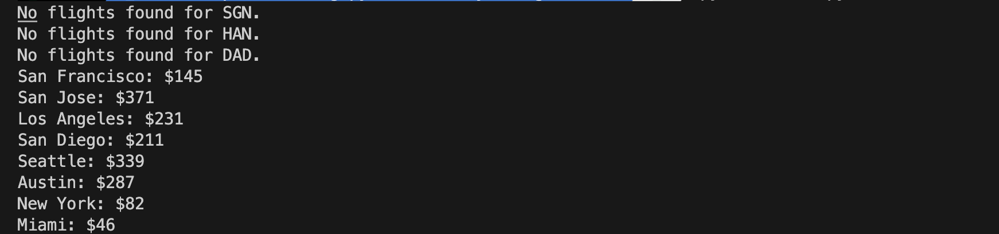
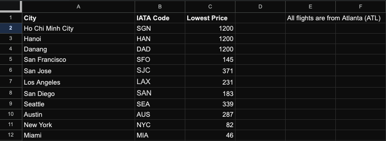
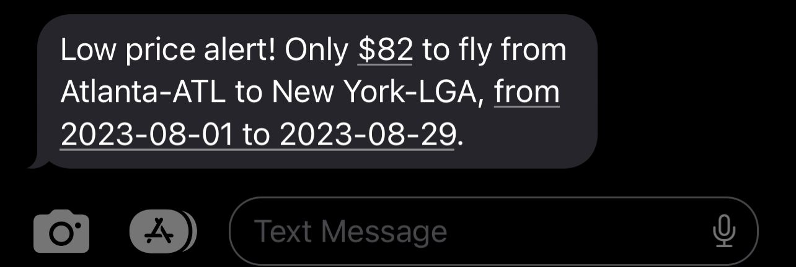

# Flight Tracker
Tracking cheapest flights from ATL (or CHA) to SGN, SFO, LAX, NYC, etc. that were added in a linked Google Sheet. If a city is added without an [IATA code](https://en.wikipedia.org/wiki/IATA_airport_code), the IATA code is updated automatically by the python script. If a cheaper flight price is found, an SMS alert will be sent using Twilio.

Run `cp .env.sample .env` to create an `.env` file and update the file accordingly. User is required to sign up at [Sheety](https://sheety.co/), [Tequila by Kiwi](https://tequila.kiwi.com/), and [twilio](https://www.twilio.com/) in order to run this Python script.

 

### Updating Google Sheet

 

### Console output

 

### Final result

 

### SMS
